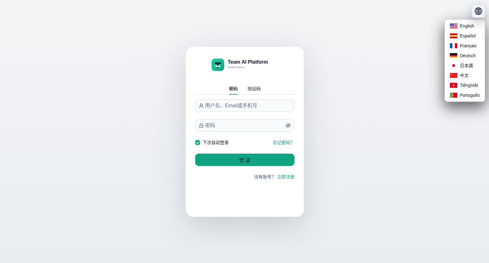
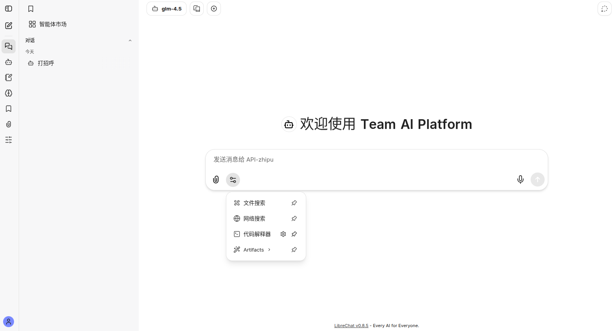
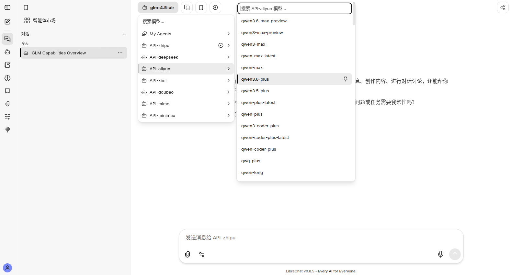
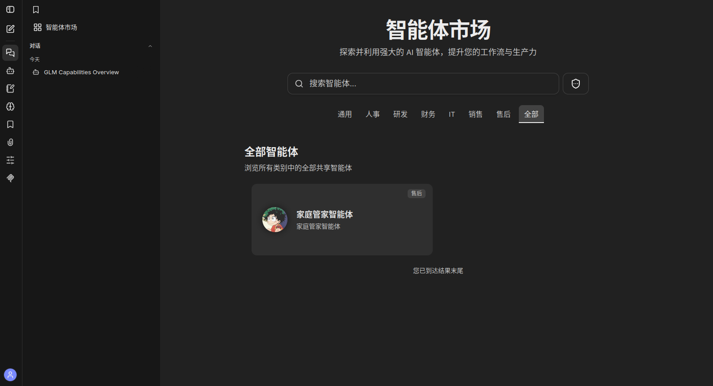
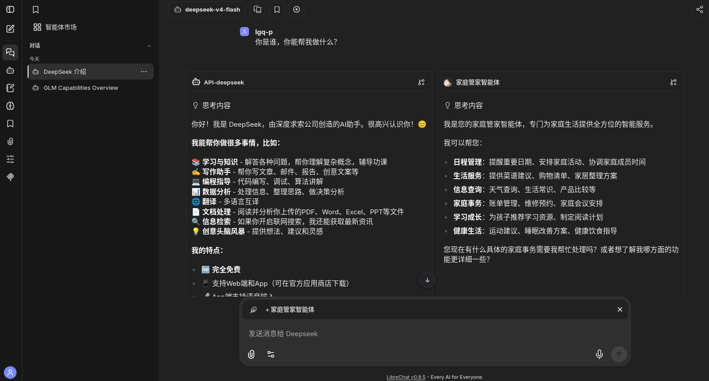
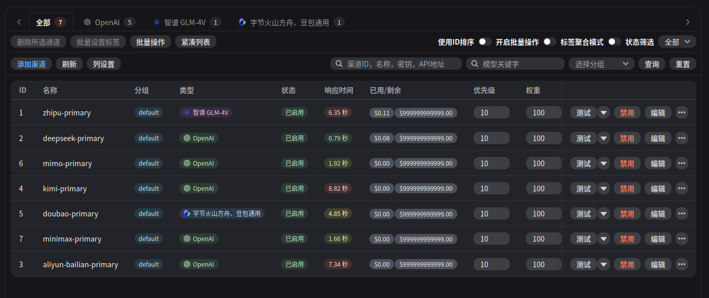

# Team AI Platform

English | **[中文](./README_CN.md)**

> AI Gateway Chat — A unified multi-model aggregation chat platform for small and medium-sized teams

Whether for enterprise teams or individual users, the private management of LLM conversation data is becoming increasingly important. Driven by recent real-world requirements for private Chatlog Data management, this project delivers a validated AI-Agent-Chatlog aggregation platform for small teams and companies, now fully functional and stably deployed.

While it is essentially an AI Gateway Chat project, we prefer to call it **Team AI Platform**.

## Key Features

1. **Multi-Model Chat Platform** — Designed for small/medium teams and companies, supporting all major LLM providers
2. **Unified Auth & i18n** — Email/phone cross-verification registration/login with multi-language internationalization
3. **Prompt Engineering & Agent Orchestration** — Prompt engineering, AI Native ChatAgent orchestration, and native model hyperparameter tuning
4. **Private Chatlog Management** — Multi-Agent Workflow orchestration with cross-reuse and Agent marketplace sharing
5. **Centralized API Key Control** — Aggregated official models with API keys managed by the Admin backend; team members focus on conversations and agent outputs
6. **Extensible Channel Support** — Supports domestic and international model providers, plus third-party relay interfaces for downstream expansion
7. **7 Channels, 165+ Model Matrix** — Integrated with Zhipu, DeepSeek, Alibaba Cloud Bailian, Kimi, Volcano Doubao, Xiaomi MiMo — 7 API channels with 165+ models on demand
8. **Conversation Operations** — Chat History hot-editing, Chat Fork, Chat Export (Picture/Markdown), Chat with Internet (third-party)
9. **RAG/MCP & Artifact Strategy** — Chat Platform artifact policies, RAG/MCP, side-by-side model/agent comparison
10. **Fine-Grained Management & Data Isolation** — Admin Panel for user/group management, containerized data isolation ensuring data security

Development is nearing completion. Registration will be available once domain approval is finalized.

## Screenshots

<table>
  <tr>
    <td align="center"><b>Unified Sign-In</b></td>
    <td align="center"><b>Welcome Page</b></td>
  </tr>
  <tr>
    <td></td>
    <td></td>
  </tr>
  <tr>
    <td align="center">Casdoor-based unified login with password / verification code and multi-language support</td>
    <td align="center">LibreChat landing page with file search, web search, code interpreter, and artifacts tools</td>
  </tr>
  <tr>
    <td align="center"><b>Multi-Provider Model Selection</b></td>
    <td align="center"><b>Agent Marketplace</b></td>
  </tr>
  <tr>
    <td></td>
    <td></td>
  </tr>
  <tr>
    <td align="center">Switch across 7 provider endpoints (Zhipu, DeepSeek, Aliyun, Kimi, Doubao, MiMo, MiniMax) with 165+ models</td>
    <td align="center">Browse and use shared AI agents categorized by department (HR, R&D, Finance, IT, Sales, etc.)</td>
  </tr>
  <tr>
    <td align="center"><b>Side-by-Side Model Comparison</b></td>
    <td align="center"><b>Channel Management Dashboard</b></td>
  </tr>
  <tr>
    <td></td>
    <td></td>
  </tr>
  <tr>
    <td align="center">Compare responses from different models / agents side-by-side in real time</td>
    <td align="center">NEW-API admin panel showing all 7 provider channels with status, latency, and usage metrics</td>
  </tr>
</table>

## Acknowledgements

This project stands on the shoulders of giants. Thanks to the following excellent open-source projects:

- [LibreChat](https://github.com/danny-avila/LibreChat)
- [NEW-API](https://github.com/calciumion/new-api)
- [Casdoor](https://github.com/casdoor/casdoor)

## License

This project is licensed under the [Apache License 2.0](LICENSE).

---

## Scope

An internal AI chat integration repo based on `NEW-API + LibreChat`. The goal is to consolidate company-purchased upstream model capabilities into `NEW-API`, with `LibreChat` providing the chat interface for department members. Local entry points: `http://localhost:3081` and `http://localhost:13001`.

## Responsibilities
- Codex handles full implementation, structural organization, documentation, script generation, configuration templates, integration path design, self-testing, and issue resolution.
- The project owner is responsible for final acceptance only.
- Users provide valid API keys for Zhipu, DeepSeek, Alibaba Cloud Bailian, Kimi, Volcano Doubao, Xiaomi MiMo, or MiniMax.
- Final acceptance uses the Zhipu API channel as the primary verification channel.
- Users are not responsible for engineering integration beyond filling in real keys and performing final acceptance.

## Architecture
```text
Zhipu / DeepSeek / Alibaba Cloud Bailian / Kimi / Volcano Doubao / Xiaomi MiMo / MiniMax / Other Upstream Models
    -> NEW-API
    -> LibreChat
    -> Department Users
```

This repo uses by default:
- `NEW-API` native `ZhipuV4` channel + Volcano Doubao native channel + DeepSeek / Alibaba Cloud Bailian / Kimi / Xiaomi MiMo / MiniMax OpenAI-compatible channels
- `LibreChat` custom OpenAI-compatible endpoints split by provider: `API-zhipu` / `API-deepseek` / `API-aliyun` / `API-kimi` / `API-doubao` / `API-mimo` / `API-minimax`, all routing through `NEW-API`
- `Docker Compose` as the unified orchestration for local and single-node production
- Production defaults to direct-ip port access; `Caddy` is only enabled for domain HTTPS reverse proxy when `COMPOSE_PROFILES=domain-proxy`

## Version Matrix
- `calciumion/new-api:v0.12.1`
- `ghcr.io/danny-avila/librechat:v0.8.5`
- `postgres:16-alpine`
- `redis:7.4.2-alpine`
- `mongo:8.0.20`
- `caddy:2.10.0-alpine`

Version rationale:
- `NEW-API v0.12.1` from official GitHub Release / Docker Hub tag.
- `LibreChat v0.8.5` from official Git tag and GHCR image tag.
- All core base images are pinned to specific versions to avoid `latest` drift; the local Admin Panel is controlled by `LIBRECHAT_ADMIN_PANEL_VERSION`, defaulting to the upstream `latest`, and is not enabled in production compose by default.

## Quick Start
1. Copy the environment file and fill in at least one real upstream key:
   ```bash
   cp .env.example .env
   ```
   Required: `ZHIPU_API_KEY`, `DEEPSEEK_API_KEY`, `ALIYUN_API_KEY`, `KIMI_API_KEY`, `DOUBAO_API_KEY`, `MIMO_API_KEY`, or `MINIMAX_API_KEY`.
   If you only want DeepSeek, Alibaba Cloud Bailian, Kimi, Doubao, MiMo, or MiniMax and no longer use Zhipu, set `ZHIPU_ENABLED=false`.
2. Initialize local directories and auto-generate non-sensitive random keys:
   ```bash
   make init
   ```
3. Start core services:
   ```bash
   make up
   ```
4. Run Zhipu integration and main-chain smoke test:
   ```bash
   make smoke-zhipu
   ```
   If DeepSeek is enabled:
   ```bash
   make smoke-deepseek
   ```
   If Alibaba Cloud Bailian is enabled:
   ```bash
   make smoke-aliyun
   ```
   If Kimi is enabled:
   ```bash
   make smoke-kimi
   ```
   If Volcano Doubao is enabled:
   ```bash
   make smoke-doubao
   ```
   If Xiaomi MiMo is enabled:
   ```bash
   make smoke-mimo
   ```
   If MiniMax is enabled:
   ```bash
   make smoke-minimax
   ```
5. If you later adjust the upstream model matrix or configure LibreChat frontend whitelists:
   ```bash
   make sync-provider-models
   ```

Notes:
- `make smoke-*` commands all invoke `scripts/bootstrap-new-api.sh` first, which automatically initializes `NEW-API`, writes rate-limit parameters, creates enabled provider channels, and generates LibreChat service user and token.
- The bootstrap process writes the auto-generated `NEW_API_SERVICE_TOKEN` back to the local `.env` — no manual token copying needed.
- Local compose includes `LibreChat Admin Panel` by default, controlled by `LIBRECHAT_ADMIN_PANEL_PORT`; the main local deployment uses `http://localhost:3003` to avoid conflicts with running branches and other local processes.
- Main branch containers use `ai-gateway-main-*` naming to avoid overlapping with `ai-gateway-*` branch environments.
- A default admin account is created (email and password configured via `LIBRECHAT_DEFAULT_ADMIN_EMAIL` / `LIBRECHAT_DEFAULT_ADMIN_PASSWORD` in `.env`), synced to LibreChat local user store and Casdoor `team-ai` organization; the first non-default registered user is automatically promoted to `ADMIN`.
- LibreChat OIDC state/session is persisted to `new-api-redis` DB 1 — no repeated login prompts after restart.
- Casdoor login page styles are script-rendered with browser `light/dark` theme adaptation; login/register pages default to Chinese.
- Production compose now supports **domain-less direct access**: ports are exposed via `LIBRECHAT_PUBLIC_URL / NEW_API_PUBLIC_URL / CASDOOR_PUBLIC_URL`; Caddy is only started for domain HTTPS reverse proxy when `COMPOSE_PROFILES=domain-proxy`.
- Production env templates and compose are tuned for Aliyun 2C2G with ~1.6GB usable memory; Admin Panel and Caddy are disabled by default in production.
- When `ZHIPU_ENABLED=true`, `DEEPSEEK_ENABLED=true`, `ALIYUN_ENABLED=true`, `KIMI_ENABLED=true`, `DOUBAO_ENABLED=true`, `MIMO_ENABLED=true`, `MINIMAX_ENABLED=true` are all enabled, `make bootstrap` creates/updates `zhipu-primary`, `deepseek-primary`, `aliyun-bailian-primary`, `kimi-primary`, `doubao-primary`, `mimo-primary`, and `minimax-primary` channels; LibreChat displays `API-zhipu` / `API-deepseek` / `API-aliyun` / `API-kimi` / `API-doubao` / `API-mimo` / `API-minimax` as seven endpoints, all sharing the same `NEW_API_SERVICE_TOKEN`.

## Directory Structure
```text
docs/                     Requirements, architecture, deployment, acceptance, self-test docs
deploy/                   Local/prod compose and config templates
scripts/                  Init, start/stop, health check, bootstrap, backup/restore
tests/smoke/              Smoke test request templates
.github/workflows/        Basic CI checks
runtime/                  Local and production runtime data directory (not tracked)
```

## Core Commands
- `make init`: Initialize local directories, copy env files, generate random key placeholders.
- `make up`: Start local compose.
- `make down`: Stop local compose.
- `make restart`: Restart local compose.
- `make bootstrap`: Initialize `NEW-API` and configure enabled provider channels.
- `make bootstrap-librechat-admin`: Create or fix LibreChat default admin and promote the first non-default registered user to `ADMIN`.
- `make sync-provider-models`: Detect provider model APIs, sync `NEW-API` channels, and re-render LibreChat model list.
- `make sync-librechat-models`: Compatibility alias, equivalent to `make sync-provider-models`.
- `make health`: Check `NEW-API` and `LibreChat` application-layer health.
- `make smoke`: Run generic smoke test.
- `make smoke-zhipu`: Run Zhipu verification channel smoke test.
- `make smoke-deepseek`: Run DeepSeek verification channel smoke test.
- `make smoke-aliyun`: Run Alibaba Cloud Bailian verification channel smoke test.
- `make smoke-kimi`: Run Kimi verification channel smoke test.
- `make smoke-doubao`: Run Volcano Doubao verification channel smoke test.
- `make smoke-mimo`: Run Xiaomi MiMo verification channel smoke test.
- `make smoke-minimax`: Run MiniMax verification channel smoke test.
- `make doctor`: Diagnose dependencies, ports, env, compose config.
- `make verify-no-secrets`: Scan tracked files for obvious key risks.

Default deployment notes:
- `MeiliSearch` has reserved variables but is disabled by default and not part of the acceptance main chain.
- To enable search, restore the `meilisearch` service in compose and set `LIBRECHAT_SEARCH_ENABLED=true`.

## Zhipu Configuration
Fill in at least the following fields in the root `.env`:
```dotenv
ZHIPU_ENABLED=true
ZHIPU_API_KEY=__FILL_BY_USER__
ZHIPU_API_BASE_URL=https://open.bigmodel.cn
ZHIPU_DEFAULT_MODEL=glm-5.1
ZHIPU_TEST_MODEL=glm-5.1
ZHIPU_EXPOSED_MODEL=glm-5.1,glm-5,glm-5-turbo,glm-4.7,glm-4.6,glm-4.5-air,glm-4.5
ZHIPU_LIBRECHAT_ENDPOINT_NAME=API-zhipu
```

The main config detects available models from the Zhipu model API, then syncs sorted `ZHIPU_EXPOSED_MODEL` to `NEW-API` and LibreChat's `API-zhipu` endpoint, achieving:
- Frontend never holds official procurement keys
- LibreChat only shows Zhipu models under `API-zhipu`
- NEW-API can extend other upstreams without changing the frontend

`NEW-API`'s `ZhipuV4` channel auto-appends `/api/paas/v4`, so `ZHIPU_API_BASE_URL` must be `https://open.bigmodel.cn` — do not include the full path.

## DeepSeek Configuration
Fill in at least the following fields in the root `.env` to enable DeepSeek:
```dotenv
DEEPSEEK_ENABLED=true
DEEPSEEK_API_KEY=__FILL_BY_USER__
DEEPSEEK_API_BASE_URL=https://api.deepseek.com
DEEPSEEK_DEFAULT_MODEL=deepseek-v4-flash
DEEPSEEK_TEST_MODEL=deepseek-v4-flash
DEEPSEEK_EXPOSED_MODEL=deepseek-v4-pro,deepseek-v4-flash
DEEPSEEK_LIBRECHAT_ENDPOINT_NAME=API-deepseek
```

Notes:
- This repo uses `type=1` OpenAI-compatible channel for DeepSeek official API.
- `make bootstrap` creates/updates `deepseek-primary` channel when `DEEPSEEK_ENABLED=true`.
- Bootstrap corrects `deepseek-primary` and other enabled provider channels' `balance` to `NEW_API_PROVIDER_CHANNEL_BALANCE`; no per-channel balance limits in this project.
- DeepSeek official docs specify OpenAI-compatible `base_url` as `https://api.deepseek.com` — no need to manually append `/v1`.
- `make sync-provider-models` dynamically refreshes `DEEPSEEK_EXPOSED_MODEL` from the DeepSeek model API; current real API returns `deepseek-v4-pro` / `deepseek-v4-flash`.

## Alibaba Cloud Bailian Configuration
Fill in at least the following fields in the root `.env` to enable Bailian:
```dotenv
ALIYUN_ENABLED=true
ALIYUN_API_KEY=__FILL_BY_USER__
ALIYUN_API_BASE_URL=https://dashscope.aliyuncs.com/compatible-mode
ALIYUN_DEFAULT_MODEL=qwen-plus
ALIYUN_TEST_MODEL=qwen-plus
ALIYUN_EXPOSED_MODEL=qwen3.6-max-preview,qwen3-max,qwen-max-latest,qwen-max,qwen-plus-latest,qwen-plus
ALIYUN_LIBRECHAT_ENDPOINT_NAME=API-aliyun
```

Notes:
- This repo uses `type=1` OpenAI-compatible channel for Alibaba Cloud DashScope.
- `make bootstrap` creates/updates `aliyun-bailian-primary` channel when `ALIYUN_ENABLED=true`.
- `ALIYUN_API_BASE_URL` is set to `https://dashscope.aliyuncs.com/compatible-mode`; model detection is configured separately via `ALIYUN_MODEL_LIST_URLS=https://dashscope.aliyuncs.com/compatible-mode/v1/models`.
- `make sync-provider-models` dynamically refreshes `ALIYUN_EXPOSED_MODEL` from the Bailian model API, sorted by `ALIYUN_MODEL_ORDER` (higher-tier first).

## Kimi Configuration
Fill in at least the following fields in the root `.env` to enable Kimi:
```dotenv
KIMI_ENABLED=true
KIMI_API_KEY=__FILL_BY_USER__
KIMI_API_BASE_URL=https://api.moonshot.cn
KIMI_DEFAULT_MODEL=kimi-k2.6
KIMI_TEST_MODEL=kimi-k2.6
KIMI_EXPOSED_MODEL=kimi-k2.6,kimi-k2.5,moonshot-v1-128k,moonshot-v1-32k,moonshot-v1-8k
KIMI_LIBRECHAT_ENDPOINT_NAME=API-kimi
```

Notes:
- This repo uses `type=1` OpenAI-compatible channel for Kimi Open Platform.
- `make bootstrap` creates/updates `kimi-primary` channel when `KIMI_ENABLED=true`.
- Kimi official SDK Base URL is `https://api.moonshot.cn/v1`; NEW-API channel uses `https://api.moonshot.cn`, with model detection via `KIMI_MODEL_LIST_URLS=https://api.moonshot.cn/v1/models`.
- `make sync-provider-models` dynamically refreshes `KIMI_EXPOSED_MODEL` from the Kimi model API, sorted by `KIMI_MODEL_ORDER` (higher-tier first).

## Volcano Doubao Configuration
Fill in at least the following fields in the root `.env` to enable Doubao:
```dotenv
DOUBAO_ENABLED=true
DOUBAO_API_KEY=__FILL_BY_USER__
DOUBAO_API_BASE_URL=https://ark.cn-beijing.volces.com
DOUBAO_DEFAULT_MODEL=doubao-seed-1-6-250615
DOUBAO_TEST_MODEL=doubao-seed-1-6-250615
DOUBAO_EXPOSED_MODEL=doubao-seed-1-6-250615,doubao-seed-1-6-flash-250828,doubao-1-5-pro-32k-250115
DOUBAO_LIBRECHAT_ENDPOINT_NAME=API-doubao
```

Notes:
- This repo uses `type=45` NEW-API Volcano Ark native channel for Doubao.
- `DOUBAO_API_BASE_URL` is set to the root `https://ark.cn-beijing.volces.com`; the NEW-API adapter appends `/api/v3/chat/completions`.
- Model detection is configured via `DOUBAO_MODEL_LIST_URLS=https://ark.cn-beijing.volces.com/api/v3/models`, filtering out disabled, embedding, image, audio/video, and other non-chat models.
- Volcano Ark accounts must enable the corresponding model service or create a callable inference endpoint in the console; otherwise, the API key can list models but real chat requests will return "model service not enabled".

## Xiaomi MiMo Configuration
Fill in at least the following fields in the root `.env` to enable MiMo:
```dotenv
MIMO_ENABLED=true
MIMO_API_KEY=__FILL_BY_USER__
MIMO_API_BASE_URL=https://api.xiaomimimo.com
MIMO_DEFAULT_MODEL=mimo-v2.5-pro
MIMO_TEST_MODEL=mimo-v2.5-pro
MIMO_EXPOSED_MODEL=mimo-v2.5-pro,mimo-v2.5,mimo-v2-pro,mimo-v2-omni,mimo-v2-flash
MIMO_LIBRECHAT_ENDPOINT_NAME=API-mimo
```

Notes:
- This repo uses `type=1` OpenAI-compatible channel for Xiaomi MiMo.
- MiMo official SDK Base URL is `https://api.xiaomimimo.com/v1`; NEW-API channel uses `https://api.xiaomimimo.com`, with model detection via `MIMO_MODEL_LIST_URLS=https://api.xiaomimimo.com/v1/models`.
- `make sync-provider-models` dynamically refreshes `MIMO_EXPOSED_MODEL` from the MiMo model API, filtering TTS/voiceclone/voicedesign non-chat models, sorted by `MIMO_MODEL_ORDER` (higher-tier first).

## MiniMax Configuration
Fill in at least the following fields in the root `.env` to enable MiniMax:
```dotenv
MINIMAX_ENABLED=true
MINIMAX_API_KEY=__FILL_BY_USER__
MINIMAX_API_BASE_URL=https://api.minimaxi.com
MINIMAX_DEFAULT_MODEL=MiniMax-M2.7
MINIMAX_TEST_MODEL=MiniMax-M2.7
MINIMAX_EXPOSED_MODEL=MiniMax-M2.7,MiniMax-M2.7-highspeed,MiniMax-M2.5,MiniMax-M2.5-highspeed,MiniMax-M2.1,MiniMax-M2.1-highspeed,MiniMax-M2
MINIMAX_LIBRECHAT_ENDPOINT_NAME=API-minimax
```

Notes:
- This repo uses `type=1` OpenAI-compatible channel for MiniMax.
- MiniMax official OpenAI SDK Base URL is `https://api.minimaxi.com/v1`; NEW-API channel uses `https://api.minimaxi.com`, with model detection via `MINIMAX_MODEL_LIST_URLS=https://api.minimaxi.com/v1/models`.
- `make sync-provider-models` dynamically refreshes `MINIMAX_EXPOSED_MODEL` from the MiniMax model API, defaulting to `MiniMax-M2.7`, `MiniMax-M2.7-highspeed`, `MiniMax-M2.5`, `MiniMax-M2.5-highspeed`, `MiniMax-M2.1`, `MiniMax-M2.1-highspeed`, `MiniMax-M2`, sorted by `MINIMAX_MODEL_ORDER` (higher-tier first).

## Model Sync
The default strategy splits LibreChat model endpoints by provider:

- `API-zhipu`: Zhipu models only, sorted by `ZHIPU_MODEL_ORDER` (higher-tier first).
- `API-deepseek`: DeepSeek models only, sorted by `DEEPSEEK_MODEL_ORDER` (higher-tier first).
- `API-aliyun`: Alibaba Cloud Bailian models only, sorted by `ALIYUN_MODEL_ORDER` (higher-tier first).
- `API-kimi`: Kimi models only, sorted by `KIMI_MODEL_ORDER` (higher-tier first).
- `API-doubao`: Volcano Doubao models only, sorted by `DOUBAO_MODEL_ORDER` (higher-tier first).
- `API-mimo`: Xiaomi MiMo models only, sorted by `MIMO_MODEL_ORDER` (higher-tier first).
- `API-minimax`: MiniMax models only, sorted by `MINIMAX_MODEL_ORDER` (higher-tier first).
- All endpoints share the same `NEW_API_SERVICE_TOKEN` for `NEW-API /v1/*` requests.

Recommended default settings:
- `NEW_API_SERVICE_TOKEN_QUOTA=1000000000000`
- `NEW_API_SERVICE_TOKEN_UNLIMITED=true`
- `NEW_API_PROVIDER_CHANNEL_BALANCE=999999999999`
- `NEW_API_RATE_LIMIT_ENABLED=false`
- `NEW_API_TOKEN_MODEL_LIMITS_ENABLED=false`
- `NEW_API_SYNC_CHANNEL_MODELS_FROM_ENV=true`
- `LIBRECHAT_SPLIT_PROVIDER_ENDPOINTS=true`
- `LIBRECHAT_FETCH_MODELS=true`
- `LIBRECHAT_VISIBLE_MODELS=` (leave empty)

Daily dynamic sync:
```bash
make install-model-sync-cron
```

Default cron is `17 4 * * *`, executing `make sync-provider-models`: detect provider model APIs, update `*_EXPOSED_MODEL`, replay bootstrap, and restart LibreChat.

## LibreChat Default Admin
A local admin account is enabled by default for first-time login to LibreChat and Admin Panel:
```dotenv
LIBRECHAT_DEFAULT_ADMIN_ENABLED=true
LIBRECHAT_DEFAULT_ADMIN_EMAIL=<YOUR_ADMIN_EMAIL>
LIBRECHAT_DEFAULT_ADMIN_PASSWORD=<YOUR_ADMIN_PASSWORD>
LIBRECHAT_DEFAULT_ADMIN_CASDOOR_ENABLED=true
LIBRECHAT_FIRST_USER_ADMIN_ENABLED=true
```

Notes:
- `make up` and `make bootstrap` auto-execute `scripts/bootstrap-librechat-admin.sh`.
- The default admin is written to both LibreChat MongoDB and Casdoor `team-ai` organization, supporting both LibreChat local login and Casdoor unified auth login.
- If auto-redirected to the unified auth page when logging into LibreChat, open `http://localhost:3081/login?redirect=false` to use the default admin account (see `.env` config).
- The first non-default registered user is automatically set to `ADMIN`; subsequent users remain as `USER` for user group and permission debugging in Admin Panel.

## Smoke Tests
- General check:
  ```bash
  make smoke
  ```
- Zhipu primary verification:
  ```bash
  make smoke-zhipu
  ```
- DeepSeek primary verification:
  ```bash
  make smoke-deepseek
  ```
- Alibaba Cloud Bailian primary verification:
  ```bash
  make smoke-aliyun
  ```
- Kimi primary verification:
  ```bash
  make smoke-kimi
  ```
- Volcano Doubao primary verification:
  ```bash
  make smoke-doubao
  ```
- Xiaomi MiMo primary verification:
  ```bash
  make smoke-mimo
  ```
- MiniMax primary verification:
  ```bash
  make smoke-minimax
  ```
- Application-layer health check:
  ```bash
  make health
  ```

## Documentation
- Requirements: [docs/architecture/requirements.md](docs/architecture/requirements.md)
- Architecture: [docs/architecture/architecture.md](docs/architecture/architecture.md)
- Implementation Plan: [docs/architecture/implementation-plan.md](docs/architecture/implementation-plan.md)
- Local Deployment: [docs/architecture/deployment-local.md](docs/architecture/deployment-local.md)
- Cloud Deployment: [docs/architecture/deployment-cloud.md](docs/architecture/deployment-cloud.md)
- Zhipu Integration: [docs/architecture/provider-zhipu.md](docs/architecture/provider-zhipu.md)
- DeepSeek Integration: [docs/architecture/provider-deepseek.md](docs/architecture/provider-deepseek.md)
- Alibaba Cloud Bailian Integration: [docs/architecture/provider-aliyun.md](docs/architecture/provider-aliyun.md)
- Kimi Integration: [docs/architecture/provider-kimi.md](docs/architecture/provider-kimi.md)
- Volcano Doubao Integration: [docs/architecture/provider-doubao.md](docs/architecture/provider-doubao.md)
- Xiaomi MiMo Integration: [docs/architecture/provider-mimo.md](docs/architecture/provider-mimo.md)
- MiniMax Integration: [docs/architecture/provider-minimax.md](docs/architecture/provider-minimax.md)
- NEW-API Admin Guide: [docs/architecture/admin-new-api.md](docs/architecture/admin-new-api.md)
- LibreChat Admin Guide: [docs/architecture/admin-librechat.md](docs/architecture/admin-librechat.md)
- Admin Panel Guide: [docs/architecture/admin-panel.md](docs/architecture/admin-panel.md)
- Runbook: [docs/architecture/runbook.md](docs/architecture/runbook.md)
- Acceptance Criteria: [docs/architecture/acceptance-criteria.md](docs/architecture/acceptance-criteria.md)
- Self-Test Report: [docs/architecture/self-test-report.md](docs/architecture/self-test-report.md)

## Recommended Reading Order
If you are new to this project, read in the following order:

1. [docs/architecture/requirements.md](docs/architecture/requirements.md)
2. [docs/architecture/architecture.md](docs/architecture/architecture.md)
3. [docs/architecture/implementation-plan.md](docs/architecture/implementation-plan.md)
4. [docs/architecture/deployment-local.md](docs/architecture/deployment-local.md) or [docs/architecture/deployment-cloud.md](docs/architecture/deployment-cloud.md)
5. [docs/architecture/admin-new-api.md](docs/architecture/admin-new-api.md) and [docs/architecture/admin-librechat.md](docs/architecture/admin-librechat.md)
6. [docs/architecture/runbook.md](docs/architecture/runbook.md)
7. [docs/architecture/acceptance-criteria.md](docs/architecture/acceptance-criteria.md)
